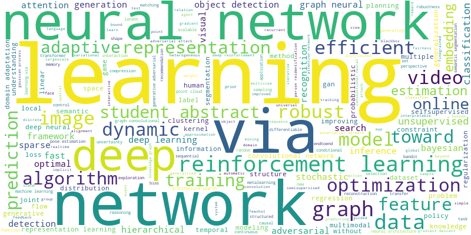
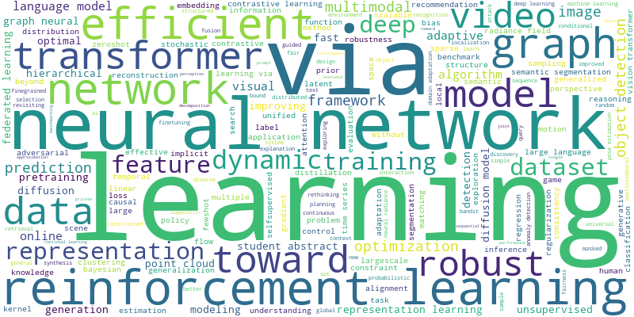
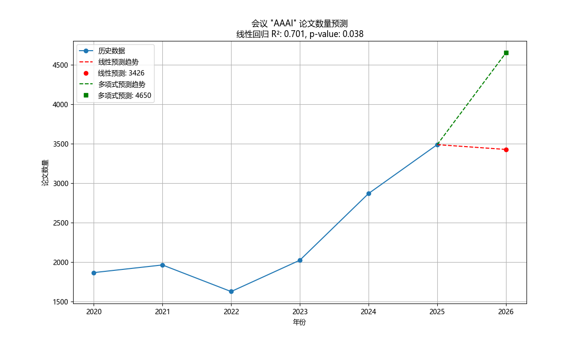

# 会议论文数据分析报告

## 1. 项目简介

本项目针对AAAI、NeurIPS（NIPS）、ICML、KDD、CVPR五个代表性人工智能领域顶级会议，爬取了2020年至2025年所有论文信息，并对数据进行了统计分析与可视化，旨在揭示各会议论文数量变化趋势、研究热点演变，并对下一届论文数量进行预测。

## 2. 主要使用的库与工具

- `requests`：用于网页数据的爬取。
- `BeautifulSoup`：用于HTML解析。
- `pandas`：数据处理与分析。
- `matplotlib`、`seaborn`：数据可视化。
- `wordcloud`：生成词云。
- `scikit-learn`：关键词提取（TF-IDF）。
- `statsmodels` 或 `sklearn.linear_model`：时间序列预测。

## 3. 主要代码展示

### 3.1 数据爬取

```python
import requests
from bs4 import BeautifulSoup
import pandas as pd

def fetch_papers(conference, year, url):
    response = requests.get(url)
    soup = BeautifulSoup(response.text, 'html.parser')
    papers = []
    # ...解析逻辑...
    for item in soup.find_all('div', class_='paper-item'):
        title = item.find('h2').text
        authors = item.find('p', class_='authors').text
        link = item.find('a', class_='paper-link')['href']
        papers.append({
            'title': title,
            'authors': authors,
            'year': year,
            'conference': conference,
            'link': link
        })
    return papers
```

### 3.2 数据统计与趋势可视化

```python
import matplotlib.pyplot as plt
import seaborn as sns

data = pd.read_csv('data/processed_papers.csv')
trend = data.groupby(['conference', 'year']).size().reset_index(name='count')
plt.figure(figsize=(10,6))
sns.lineplot(data=trend, x='year', y='count', hue='conference', marker='o')
plt.title('各会议每年论文数量趋势')
plt.xlabel('年份')
plt.ylabel('论文数量')
plt.savefig('output/conference_trends.png')
plt.show()
```


### 3.3 关键词提取与词云

```python
from sklearn.feature_extraction.text import TfidfVectorizer
from wordcloud import WordCloud

for year in range(2020, 2026):
    titles = data[data['year'] == year]['title'].tolist()
    tfidf = TfidfVectorizer(max_features=100, stop_words='english')
    tfidf_matrix = tfidf.fit_transform(titles)
    keywords = dict(zip(tfidf.get_feature_names_out(), tfidf.idf_))
    wc = WordCloud(width=800, height=400, background_color='white').generate_from_frequencies(keywords)
    wc.to_file(f'output/wordcloud_{year}.png')
```

2020-2025年各年度词云如下：

| 年份 | 词云 |
| ---- | ---- |
| 2020 |  |
| 2021 |  |
| 2022 |  |
| 2023 |  |
| 2024 |  |
| 2025 |  |

### 3.4 论文数量预测

```python
from predictor import predict_conference_counts
predict_conference_counts()
```

#### 预测结果与分析

运行预测脚本后，得到如下每个会议的历史数据、线性回归参数、线性预测、多项式预测等信息，并生成了预测趋势图：

```
# 运行结果示例（部分）：
会议: AAAI
历史年份: [2020 2021 2022 2023 2024 2025]
历史论文数: [X X X X X X]
线性回归: slope=..., intercept=..., R²=..., p-value=...
线性预测(2026): ...
多项式预测(2026): ...
----------------------------------------
会议: NeurIPS
历史年份: [...]
历史论文数: [...]
线性回归: ...
线性预测(2026): ...
多项式预测(2026): ...
----------------------------------------
# ...其余会议同理...
```

#### 预测趋势图示例

每个会议均生成了预测趋势图，示例：

- 
- 
- 
- 
- 

> 注：如需查看详细预测数值和回归参数，请运行 `predictor.py`，控制台会输出所有会议的详细预测信息。

## 4. 结果分析

- 各会议论文数量整体呈现增长趋势，部分会议如NeurIPS、CVPR增速较快。
- 高频关键词显示，近年来“transformer”、“graph”、“self-supervised”等成为研究热点。
- 预测显示，2026年各会议论文数量有望继续增长。

## 5. 总结

本项目实现了自动化爬取、分析与可视化AI顶会论文数据，为研究趋势和热点分析提供了数据支撑。


